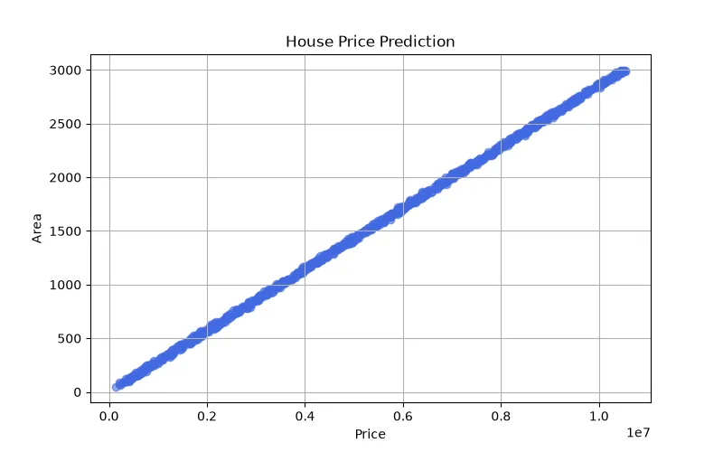

<h1 align="center">🏠 House Price Prediction</h1>

<h3 align="center">
Machine Learning Regression Project for Predicting House Prices
</h3>

<h2>📖 Project Overview</h2>

House Price Prediction is a Machine Learning regression project that predicts
the price of residential properties based on different housing features.

The main goal of this project is to build a model that learns the relationship
between house characteristics and their market value, then predicts the price
of new houses.

This project demonstrates the complete Machine Learning workflow:

<ul>
<li>Data Analysis</li>
<li>Data Preprocessing</li>
<li>Feature Selection</li>
<li>Model Training</li>
<li>Model Evaluation</li>
<li>Price Prediction</li>
</ul>

<h2>🎯 What We Are Going To Do</h2>

<ul>
<li>Load and analyze the housing dataset</li>
<li>Understand relationships between features</li>
<li>Clean and prepare the data</li>
<li>Select important features</li>
<li>Train a Machine Learning model</li>
<li>Evaluate model performance</li>
<li>Predict prices for new houses</li>
</ul>

<h2>📊 Dataset</h2>

The dataset contains information about houses and their prices.
Each row represents one house and each column represents a feature.

<table border="1">

<tr>
<th>Feature</th>
<th>Description</th>
</tr>

<tr>
<td>Area</td>
<td>Total size of the house</td>
</tr>

<tr>
<td>Bedrooms</td>
<td>Number of bedrooms</td>
</tr>

<tr>
<td>Bathrooms</td>
<td>Number of bathrooms</td>
</tr>

<tr>
<td>Location</td>
<td>Geographical location of the house</td>
</tr>

<tr>
<td>Age</td>
<td>Age of the building</td>
</tr>

<tr>
<td>Price</td>
<td>Target value to predict</td>
</tr>

</table>

<h3 align="left">Dataset Preview</h3>

<h2>🧠 Machine Learning Model</h2>

<h3>Linear Regression</h3>

Linear Regression is used as the main prediction model.
The purpose of this model is to find a mathematical relationship between
house features and house prices.

<h2>❓ Why Linear Regression?</h2>

House price prediction is a Regression Problem because the output is a continuous
numerical value.

<ul>
<li>The target value is a price.</li>
<li>The relationship between features and price can be modeled mathematically.</li>
<li>The model is simple and easy to interpret.</li>
<li>The effect of each feature can be analyzed using weights.</li>
</ul>

<h2>🧮 Mathematical Explanation</h2>

Linear Regression tries to find the best equation that represents the relationship
between input features and output price.

<b>
y = w₁x₁ + w₂x₂ + w₃x₃ + ... + wₙxₙ + b
</b>

<table border="1">

<tr>
<th>Symbol</th>
<th>Meaning</th>
</tr>

<tr>
<td>y</td>
<td>Predicted house price</td>
</tr>

<tr>
<td>x</td>
<td>Input features</td>
</tr>

<tr>
<td>w</td>
<td>Weight of each feature</td>
</tr>

<tr>
<td>b</td>
<td>Bias value</td>
</tr>

</table>

Example:

<b>
Price = w₁(Area) + w₂(Rooms) + w₃(Location) + b
</b>

The model learns the values of weights to understand how each feature affects
the final house price.

<h2>⚙ Model Learning Process</h2>

At the beginning, the model does not know the correct weights.
It starts with random values and improves them through training.

The model predicts prices and calculates the difference between predicted values
and real values.

<h3>Mean Squared Error (MSE)</h3>

<b>
MSE = (1/n) Σ(y - ŷ)²
</b>

<table border="1">

<tr>
<th>Symbol</th>
<th>Meaning</th>
</tr>

<tr>
<td>y</td>
<td>Actual house price</td>
</tr>

<tr>
<td>ŷ</td>
<td>Predicted house price</td>
</tr>

<tr>
<td>n</td>
<td>Number of samples</td>
</tr>

</table>

The goal of training is minimizing the error:

<b>
Minimize(MSE)
</b>

<h3>Gradient Descent</h3>

Weights are updated using Gradient Descent:

<b>
w = w - α ∂J(w)/∂w
</b>

<ul>
<li>α = Learning Rate</li>
<li>J(w) = Cost Function</li>
</ul>

<h2>📈 Model Evaluation</h2>

<h3>MAE (Mean Absolute Error)</h3>

Measures the average difference between predicted and real prices.

<b>
MAE = (1/n) Σ |y - ŷ|
</b>

<h3>RMSE (Root Mean Squared Error)</h3>

Shows larger prediction errors more clearly.

<b>
RMSE = √((1/n) Σ(y - ŷ)²)
</b>

<h3>R² Score</h3>

Shows how well the model explains the changes in house prices.

<h2>🛠 Technologies Used</h2>

<ul>
<li>Python</li>
<li>Pandas</li>
<li>NumPy</li>
<li>Scikit-Learn</li>
<li>Matplotlib</li>
</ul>

<h2>📂 Project Structure</h2>

<pre>

House-Price-Prediction

│
├── dataset_generator.py
│
├── models.pkl
│
├── dataset.csv
│
├── train.py
│
├── predict.py
│
└── README.md

</pre>

<h2>🚀 Future Improvements</h2>

<ul>
<li>Use advanced regression algorithms</li>
<li>Apply feature engineering techniques</li>
<li>Improve accuracy using hyperparameter tuning</li>
<li>Deploy the model as a web application</li>
<li>Add more real-world housing features</li>
</ul>

<h2>👨‍💻 Author</h2>

⭐ Learning Machine Learning by Building Real Projects 🚀

