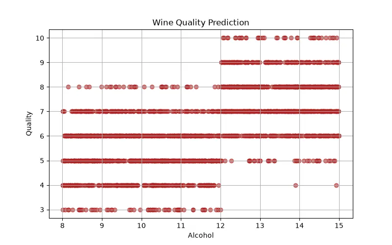

<h1 align="center">🍷 Wine Quality Prediction</h1>

<h3 align="center">
Machine Learning Classification & Regression Project for Predicting Wine Quality
</h3>

<h2>📖 Project Overview</h2>

Wine Quality Prediction is a Machine Learning project that predicts the quality
of wine based on its chemical properties.

The goal of this project is to analyze the relationship between wine
characteristics and quality scores, then build a model that can estimate the
quality of unknown wine samples.

This project demonstrates how Machine Learning can be used in the food and
beverage industry for quality control and automated evaluation.

<h2>🎯 What We Are Going To Do</h2>

<ul>

<li>Analyze wine quality dataset</li>

<li>Understand the relationship between chemical properties and quality</li>

<li>Clean and preprocess data</li>

<li>Select important features</li>

<li>Train Machine Learning models</li>

<li>Evaluate model performance</li>

<li>Predict quality of new wine samples</li>

</ul>

<h2>📊 Dataset</h2>

The dataset contains chemical measurements of different wine samples and their
quality scores.

<table border="1">

<tr>
<th>Feature</th>
<th>Description</th>
</tr>

<tr>
<td>Fixed Acidity</td>
<td>Amount of fixed acids in wine</td>
</tr>

<tr>
<td>Volatile Acidity</td>
<td>Amount of volatile acids</td>
</tr>

<tr>
<td>Citric Acid</td>
<td>Citric acid concentration</td>
</tr>

<tr>
<td>Sugar</td>
<td>Residual sugar amount</td>
</tr>

<tr>
<td>Alcohol</td>
<td>Alcohol percentage</td>
</tr>

<tr>
<td>pH</td>
<td>Acidity level</td>
</tr>

<tr>
<td>Quality</td>
<td>Wine quality score</td>
</tr>

</table>

<h3 align="left">
Dataset Preview
</h3>

<h2>🧠 Machine Learning Model</h2>

<h3>Random Forest Classifier</h3>

Random Forest Classifier is used to classify wines into quality categories
based on their chemical properties.

The model creates multiple decision trees and combines their predictions to
achieve better accuracy.

<pre>

Input:

Alcohol = 12%
pH = 3.3
Acidity = Normal

Output:

Quality = High

</pre>

<h2>❓ Why This Model?</h2>

<ul>

<li>Wine quality depends on multiple chemical factors.</li>

<li>The relationship between features and quality is nonlinear.</li>

<li>Random Forest handles complex datasets effectively.</li>

<li>It reduces overfitting using multiple trees.</li>

<li>It provides feature importance analysis.</li>

</ul>

<h2>🧮 Mathematical Explanation</h2>

Random Forest consists of multiple Decision Trees.
Each tree predicts a class and the final result is selected by voting.

<b>
Prediction = Majority Vote(Tree₁, Tree₂, ... , Treeₙ)
</b>

<h3>Decision Tree Split</h3>

Trees select the best feature split using impurity measurement.

<h3>Gini Impurity</h3>

<b>
Gini = 1 - Σp²
</b>

<table border="1">

<tr>

<th>Symbol</th>
<th>Meaning</th>

</tr>

<tr>

<td>p</td>
<td>Probability of each class</td>

</tr>

</table>

The algorithm selects splits that create more pure groups of wine quality.

<h2>⚙ Model Learning Process</h2>

<ul>

<li>Create multiple random samples from dataset</li>

<li>Build decision trees</li>

<li>Train each tree with different data</li>

<li>Collect predictions from all trees</li>

<li>Select final quality prediction</li>

</ul>

<h2>📈 Model Evaluation</h2>

<h3>Accuracy</h3>

Measures how many wine samples were classified correctly.

<b>
Accuracy = Correct Predictions / Total Predictions
</b>

<h3>Precision</h3>

Shows how many predicted quality classes were correct.

<h3>Recall</h3>

Shows how many real quality classes were detected.

<h3>F1 Score</h3>

Balances precision and recall.

<h3>Confusion Matrix</h3>

Shows classification performance between different quality levels.

<h2>🛠 Technologies Used</h2>

<ul>

<li>Python</li>

<li>Pandas</li>

<li>NumPy</li>

<li>Scikit-Learn</li>

<li>Matplotlib</li>

</ul>

<h2>📂 Project Structure</h2>

<pre>

Wine-Quality-Prediction
│
├── dataset_generator.py
│
├── img
│   └── dataset.webp
│
├── models.pkl
│
├── train.py
│
├── predict.py
│
└── README.md
</pre>

<h2>🚀 Future Improvements</h2>

<ul>

<li>Compare different Machine Learning algorithms</li>

<li>Use XGBoost and Gradient Boosting</li>

<li>Apply regression models for exact quality scores</li>

<li>Create wine recommendation system</li>

<li>Deploy as a quality prediction application</li>

</ul>

<h2>👨‍💻 Author</h2>

⭐ Learning Machine Learning by Building Real Projects 🚀

