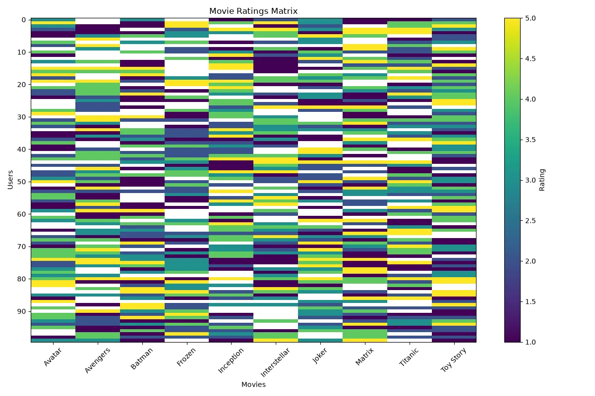

<h1 align="center">🎬 Movie Recommendation System</h1>

<h3 align="center">
Machine Learning Recommendation System Project for Suggesting Movies to Users
</h3>

<h2>📖 Project Overview</h2>

Movie Recommendation System is a Machine Learning project that suggests movies
to users based on their interests, previous ratings, and similarity between
movies.

The goal of this project is to build an intelligent system that can understand
user preferences and recommend movies that the user is likely to enjoy.

Recommendation systems are widely used in platforms such as Netflix, YouTube,
Spotify, and Amazon to personalize user experiences.

<h2>🎯 What We Are Going To Do</h2>

<ul>

<li>Analyze movie and user rating data</li>

<li>Understand user preferences</li>

<li>Find similarities between movies</li>

<li>Create a recommendation algorithm</li>

<li>Generate personalized movie suggestions</li>

<li>Evaluate recommendation quality</li>

</ul>

<h2>📊 Dataset</h2>

The dataset contains information about movies, users, and their ratings.
Each row represents a user's interaction with a movie.

<table border="1">

<tr>
<th>Feature</th>
<th>Description</th>
</tr>

<tr>
<td>User ID</td>
<td>Unique identifier for each user</td>
</tr>

<tr>
<td>Movie ID</td>
<td>Unique identifier for each movie</td>
</tr>

<tr>
<td>Movie Title</td>
<td>Name of the movie</td>
</tr>

<tr>
<td>Genre</td>
<td>Movie category</td>
</tr>

<tr>
<td>Rating</td>
<td>User rating score</td>
</tr>

<tr>
<td>Timestamp</td>
<td>Date of interaction</td>
</tr>

</table>

<h3 align="left">
Dataset Preview
</h3>

<h2>🧠 Machine Learning Model</h2>

<h3>Collaborative Filtering</h3>

Collaborative Filtering is used to recommend movies by analyzing similarities
between users and movies.

The system assumes that users with similar interests will probably like similar
movies in the future.

<pre>

Example:

User A likes:
- Interstellar
- Inception
- Matrix

User B likes:
- Interstellar
- Inception

Recommendation:

Suggest Matrix to User B

</pre>

<h2>❓ Why This Model?</h2>

<ul>

<li>Recommendations depend on user behavior.</li>

<li>The system learns from previous ratings.</li>

<li>It does not require manually defining movie rules.</li>

<li>It can discover hidden relationships between users and movies.</li>

<li>It is widely used in real-world recommendation platforms.</li>

</ul>

<h2>🧮 Mathematical Explanation</h2>

Collaborative Filtering uses similarity calculations to find relationships
between users or movies.

<h3>Cosine Similarity</h3>

<b>
Similarity(A,B) =
(A · B) / (||A|| × ||B||)
</b>

<table border="1">

<tr>
<th>Symbol</th>
<th>Meaning</th>
</tr>

<tr>
<td>A · B</td>
<td>Dot product between vectors</td>
</tr>

<tr>
<td>||A||</td>
<td>Magnitude of vector A</td>
</tr>

<tr>
<td>||B||</td>
<td>Magnitude of vector B</td>
</tr>

</table>

The higher the similarity value, the more similar two users or movies are.

<h2>⚙ Model Learning Process</h2>

<ul>

<li>Create user-movie rating matrix</li>

<li>Convert users and movies into numerical vectors</li>

<li>Calculate similarity between items</li>

<li>Find similar movies or users</li>

<li>Generate recommendations</li>

</ul>

<h3>User-Movie Matrix</h3>

<pre>

          Movie1  Movie2  Movie3

User1       5       4       0

User2       5       0       3

User3       0       4       5

</pre>

The model learns hidden patterns from this matrix.

<h2>📈 Model Evaluation</h2>

<h3>RMSE (Root Mean Squared Error)</h3>

Measures the difference between predicted ratings and real ratings.

<b>
RMSE = √((1/n)Σ(y - ŷ)²)
</b>

<h3>MAE (Mean Absolute Error)</h3>

Shows average recommendation prediction error.

<b>
MAE = (1/n)Σ|y - ŷ|
</b>

<h3>Precision@K</h3>

Measures how many recommended movies are actually relevant for users.

<h2>🛠 Technologies Used</h2>

<ul>

<li>Python</li>

<li>Pandas</li>

<li>NumPy</li>

<li>Scikit-Learn</li>

<li>Matplotlib</li>

</ul>

<h2>📂 Project Structure</h2>

<pre>

Movie-Recommendation-System
│
├── dataset_generator.py
│
├── img
│   └── dataset.webp
│
├── models.pkl
│
├── train.py
│
├── predict.py
│
└── README.md
</pre>

<h2>🚀 Future Improvements</h2>

<ul>

<li>Use Deep Learning Recommendation Models</li>

<li>Implement Neural Collaborative Filtering</li>

<li>Add movie posters and descriptions</li>

<li>Create personalized user profiles</li>

<li>Deploy as a web recommendation application</li>

<li>Use real-time recommendation techniques</li>

</ul>

<h2>👨‍💻 Author</h2>

⭐ Learning Machine Learning by Building Real Projects 🚀

