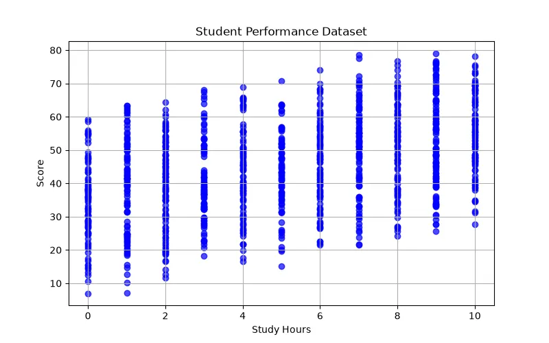

<h1 align="center">🎓 Student Performance Prediction</h1>

<h3 align="center">
Machine Learning Project for Predicting Student Academic Performance
</h3>

<h2>📖 Project Overview</h2>

Student Performance Prediction is a Machine Learning project that predicts
students' academic performance based on different educational, personal,
and behavioural factors.

The goal of this project is to understand how different factors such as
study time, attendance, previous scores, and learning conditions affect
student results.

Using Machine Learning, we create a predictive model that can estimate
a student's final performance and help identify students who may need
additional educational support.

<h2>🎯 What We Are Going To Do</h2>

<ul>

<li>Analyze student dataset</li>

<li>Understand relationships between features</li>

<li>Clean and preprocess the data</li>

<li>Select important features</li>

<li>Train a Machine Learning model</li>

<li>Evaluate prediction accuracy</li>

<li>Predict student final performance</li>

</ul>

<h2>📊 Dataset</h2>

The dataset contains information about students and their academic results.
Each sample represents one student with different educational features.

<table border="1">

<tr>
<th>Feature</th>
<th>Description</th>
</tr>

<tr>
<td>Study Time</td>
<td>Number of hours spent studying</td>
</tr>

<tr>
<td>Attendance</td>
<td>Percentage of class attendance</td>
</tr>

<tr>
<td>Previous Scores</td>
<td>Previous academic results</td>
</tr>

<tr>
<td>Sleep Hours</td>
<td>Average sleeping duration</td>
</tr>

<tr>
<td>Internet Access</td>
<td>Availability of online learning resources</td>
</tr>

<tr>
<td>Parental Education</td>
<td>Education level of parents</td>
</tr>

<tr>
<td>Final Score</td>
<td>Target value to predict</td>
</tr>

</table>

<h3 align="left">
Dataset Preview
</h3>

<h2>🧠 Machine Learning Model</h2>

<h3>Linear Regression</h3>

Linear Regression is used to predict the final score of students.
The model learns the relationship between educational factors and student results.

Example:

<pre>

Input:

Study Time = 15 hours/week
Attendance = 90%
Previous Score = 85

Output:

Predicted Final Score = 88

</pre>

<h2>❓ Why Linear Regression?</h2>

This problem is a Regression Problem because the output is a continuous
numerical value (student score).

<ul>

<li>The final score is a numerical value.</li>

<li>The model can measure the effect of each feature.</li>

<li>The relationship between learning factors and performance can be modeled mathematically.</li>

<li>The algorithm is simple and interpretable.</li>

</ul>

<h2>🧮 Mathematical Explanation</h2>

Linear Regression finds a mathematical function that maps student features
to the final score.

<b>
y = w₁x₁ + w₂x₂ + w₃x₃ + ... + wₙxₙ + b
</b>

<table border="1">

<tr>

<th>Symbol</th>

<th>Meaning</th>

</tr>

<tr>

<td>y</td>

<td>Predicted student score</td>

</tr>

<tr>

<td>x</td>

<td>Input features</td>

</tr>

<tr>

<td>w</td>

<td>Weight of each feature</td>

</tr>

<tr>

<td>b</td>

<td>Bias value</td>

</tr>

</table>

Example:

<b>
Score = w₁(StudyTime) + w₂(Attendance) + w₃(PreviousScore) + b
</b>

The model learns the weights to understand which factors have more impact
on student performance.

<h2>⚙ Model Learning Process</h2>

During training, the model starts with unknown parameters.
It makes predictions and compares them with actual student scores.

The difference between prediction and reality is calculated using a loss function.

<h3>Mean Squared Error (MSE)</h3>

<b>
MSE = (1/n) Σ(y - ŷ)²
</b>

<table border="1">

<tr>

<th>Symbol</th>

<th>Meaning</th>

</tr>

<tr>

<td>y</td>

<td>Actual student score</td>

</tr>

<tr>

<td>ŷ</td>

<td>Predicted score</td>

</tr>

<tr>

<td>n</td>

<td>Number of students</td>

</tr>

</table>

The goal of training is:

<b>
Minimize(MSE)
</b>

<h3>Gradient Descent</h3>

The model updates weights using Gradient Descent:

<b>
w = w - α ∂J(w)/∂w
</b>

<ul>

<li>α : Learning Rate</li>

<li>J(w) : Cost Function</li>

</ul>

<h2>📈 Model Evaluation</h2>

<h3>MAE (Mean Absolute Error)</h3>

Measures the average difference between predicted and actual scores.

<b>
MAE = (1/n) Σ|y - ŷ|
</b>

<h3>RMSE (Root Mean Squared Error)</h3>

Shows larger prediction errors more clearly.

<b>
RMSE = √((1/n)Σ(y - ŷ)²)
</b>

<h3>R² Score</h3>

Measures how well the model explains changes in student performance.

<h2>🛠 Technologies Used</h2>

<ul>

<li>Python</li>

<li>Pandas</li>

<li>NumPy</li>

<li>Scikit-Learn</li>

<li>Matplotlib</li>

<li>Jupyter Notebook</li>

</ul>

<h2>📂 Project Structure</h2>

<pre>

Student-Performance-Prediction

│
├── dataset_generator.py
│
├── img
│   └── dataset.webp
│
├── models.pkl
│
├── train.py
│
├── predict.py
│
└── README.md

</pre>

<h2>🚀 Future Improvements</h2>

<ul>

<li>Use advanced models like Random Forest and XGBoost</li>

<li>Add more educational features</li>

<li>Create student risk prediction system</li>

<li>Build an interactive dashboard</li>

<li>Deploy the model as an AI educational assistant</li>

</ul>

<h2>👨‍💻 Author</h2>

⭐ Learning Machine Learning by Building Real Projects 🚀

