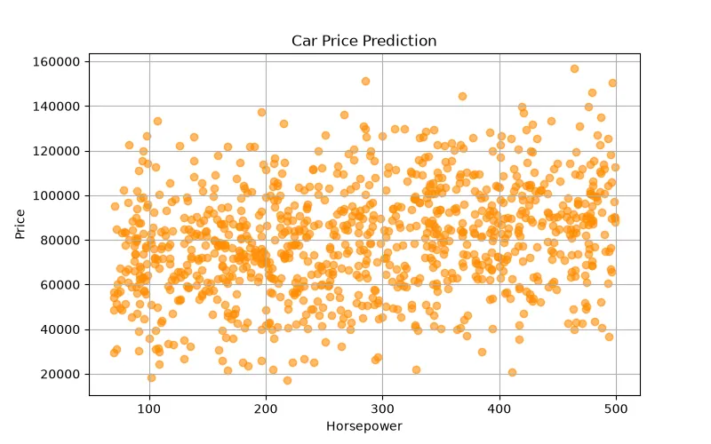

<h1 align="center">🚗 Car Price Prediction</h1>

<h3 align="center">
Machine Learning Regression Project for Predicting Used Car Prices
</h3>

<h2>📖 Project Overview</h2>

Car Price Prediction is a Machine Learning regression project that predicts
the selling price of used cars based on different vehicle features.

The goal of this project is to build a model that learns the relationship
between car specifications and market value, then predicts the expected price
of new vehicles.

The model analyzes important factors such as manufacturing year, mileage,
engine size, fuel type, transmission, and brand to estimate the car price.

<h2>🎯 What We Are Going To Do</h2>

<ul>

<li>Analyze car dataset</li>

<li>Understand the effect of different vehicle features on price</li>

<li>Clean and preprocess the data</li>

<li>Convert categorical features into numerical values</li>

<li>Select important features</li>

<li>Train a Machine Learning regression model</li>

<li>Evaluate model performance</li>

<li>Predict prices for new cars</li>

</ul>

<h2>📊 Dataset</h2>

The dataset contains information about different vehicles and their market prices.
Each row represents one car and each column represents a specific feature.

<table border="1">

<tr>
<th>Feature</th>
<th>Description</th>
</tr>

<tr>
<td>Brand</td>
<td>Car manufacturer</td>
</tr>

<tr>
<td>Model</td>
<td>Vehicle model name</td>
</tr>

<tr>
<td>Year</td>
<td>Manufacturing year</td>
</tr>

<tr>
<td>Mileage</td>
<td>Total distance traveled by the car</td>
</tr>

<tr>
<td>Engine Size</td>
<td>Engine capacity</td>
</tr>

<tr>
<td>Fuel Type</td>
<td>Petrol, Diesel, Electric</td>
</tr>

<tr>
<td>Transmission</td>
<td>Manual or Automatic</td>
</tr>

<tr>
<td>Price</td>
<td>Target value to predict</td>
</tr>

</table>

<h3 align="left">
Dataset Preview
</h3>

<h2>🧠 Machine Learning Model</h2>

<h3>Linear Regression</h3>

Linear Regression is used to predict the price of vehicles.
The model learns how each car feature affects the final market value.

Example:

<pre>

Input:

Brand = Toyota
Year = 2022
Mileage = 20000 km
Engine Size = 1800 cc

Output:

Predicted Price = $25,000

</pre>

<h2>❓ Why Linear Regression?</h2>

Car price prediction is a Regression Problem because the output is a continuous
numerical value.

<ul>

<li>Price is a numerical target variable.</li>

<li>The model can measure the relationship between features and price.</li>

<li>The importance of each feature can be represented mathematically.</li>

<li>It provides a simple and understandable baseline model.</li>

</ul>

<h2>🧮 Mathematical Explanation</h2>

Linear Regression tries to find the best mathematical equation between
car features and price.

<b>
Price = w₁x₁ + w₂x₂ + w₃x₃ + ... + wₙxₙ + b
</b>

<table border="1">

<tr>

<th>Symbol</th>
<th>Meaning</th>

</tr>

<tr>

<td>Price (y)</td>
<td>Predicted car price</td>

</tr>

<tr>

<td>x</td>
<td>Input vehicle features</td>

</tr>

<tr>

<td>w</td>
<td>Weight of each feature</td>

</tr>

<tr>

<td>b</td>
<td>Bias value</td>

</tr>

</table>

Example:

<b>
Price = w₁(Year) + w₂(Mileage) + w₃(EngineSize) + b
</b>

The model learns the weights to understand how each feature changes the price.

<h2>⚙ Model Learning Process</h2>

During training, the model starts with unknown weights.
It predicts prices and compares them with real market prices.

The difference between prediction and actual value is called error.

<h3>Mean Squared Error (MSE)</h3>

<b>
MSE = (1/n) Σ(y - ŷ)²
</b>

<table border="1">

<tr>
<th>Symbol</th>
<th>Meaning</th>
</tr>

<tr>
<td>y</td>
<td>Actual car price</td>
</tr>

<tr>
<td>ŷ</td>
<td>Predicted car price</td>
</tr>

<tr>
<td>n</td>
<td>Number of cars</td>
</tr>

</table>

The training goal is minimizing the error:

<b>
Minimize(MSE)
</b>

<h3>Gradient Descent</h3>

The model updates weights using Gradient Descent:

<b>
w = w - α ∂J(w)/∂w
</b>

<ul>

<li>α = Learning Rate</li>

<li>J(w) = Cost Function</li>

</ul>

<h2>📈 Model Evaluation</h2>

<h3>MAE (Mean Absolute Error)</h3>

Measures the average difference between predicted and actual car prices.

<b>
MAE = (1/n) Σ|y - ŷ|
</b>

<h3>RMSE (Root Mean Squared Error)</h3>

Penalizes larger prediction errors.

<b>
RMSE = √((1/n)Σ(y - ŷ)²)
</b>

<h3>R² Score</h3>

Shows how well the model explains changes in car prices.

<h2>🛠 Technologies Used</h2>

<ul>

<li>Python</li>

<li>Pandas</li>

<li>NumPy</li>

<li>Scikit-Learn</li>

<li>Matplotlib</li>

</ul>

<h2>📂 Project Structure</h2>

<pre>

Car-Price-Prediction
│
├── dataset_generator.py
│
├── img
│   └── dataset.webp
│
├── models.pkl
│
├── train.py
│
├── predict.py
│
└── README.md

</pre>

<h2>🚀 Future Improvements</h2>

<ul>

<li>Use Random Forest Regression</li>

<li>Use Gradient Boosting and XGBoost</li>

<li>Perform hyperparameter optimization</li>

<li>Create a web-based car price prediction system</li>

<li>Add more real-world vehicle features</li>

</ul>

<h2>👨‍💻 Author</h2>

⭐ Learning Machine Learning by Building Real Projects 🚀

