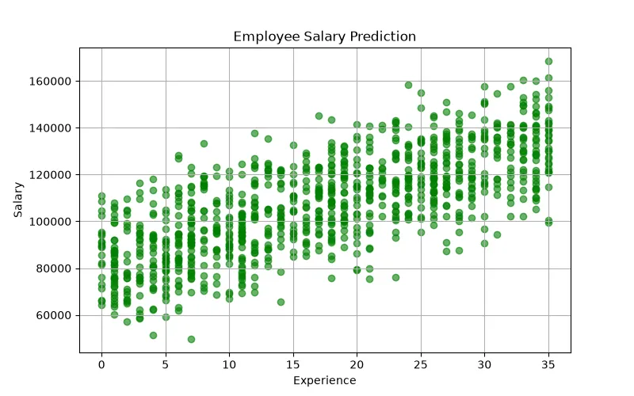

<h1 align="center">💰 Employee Salary Prediction</h1>

<h3 align="center">
Machine Learning Regression Project for Predicting Employee Salaries
</h3>

<h2>📖 Project Overview</h2>

Employee Salary Prediction is a Machine Learning regression project that predicts
employee salaries based on professional, educational, and experience-related factors.

The goal of this project is to understand how different factors such as years of
experience, education level, job position, and skills affect employee salary.

Using Machine Learning, we create a model that learns patterns from historical
employee data and predicts the expected salary of new employees.

<h2>🎯 What We Are Going To Do</h2>

<ul>

<li>Analyze employee dataset</li>

<li>Study relationships between employee features and salary</li>

<li>Clean and preprocess the data</li>

<li>Convert categorical information into numerical values</li>

<li>Select important features</li>

<li>Train a Machine Learning regression model</li>

<li>Evaluate prediction performance</li>

<li>Predict salary for new employees</li>

</ul>

<h2>📊 Dataset</h2>

The dataset contains information about employees and their salaries.
Each row represents one employee with different professional characteristics.

<table border="1">

<tr>
<th>Feature</th>
<th>Description</th>
</tr>

<tr>
<td>Experience</td>
<td>Number of years of professional experience</td>
</tr>

<tr>
<td>Education</td>
<td>Education level of employee</td>
</tr>

<tr>
<td>Job Role</td>
<td>Employee position or occupation</td>
</tr>

<tr>
<td>Skills</td>
<td>Professional skills and abilities</td>
</tr>

<tr>
<td>Age</td>
<td>Employee age</td>
</tr>

<tr>
<td>Salary</td>
<td>Target value to predict</td>
</tr>

</table>

<h3 align="left">
Dataset Preview
</h3>

<h2>🧠 Machine Learning Model</h2>

<h3>Multiple Linear Regression</h3>

Multiple Linear Regression is used because employee salary depends on multiple
input factors such as experience, education, and job position.

The model learns how different features contribute to the final salary value.

<pre>

Input:

Experience = 5 years
Education = Master Degree
Job Role = Software Engineer

Output:

Predicted Salary = $75,000

</pre>

<h2>❓ Why This Model?</h2>

Salary prediction is a Regression Problem because the output is a continuous
numerical value.

<ul>

<li>Salary is a numerical variable.</li>

<li>Multiple features influence salary.</li>

<li>The model can measure the effect of each factor.</li>

<li>The mathematical relationship is easy to understand.</li>

<li>It provides a strong baseline for salary prediction.</li>

</ul>

<h2>🧮 Mathematical Explanation</h2>

Multiple Linear Regression represents salary prediction using several input
features.

<b>
Salary = w₁x₁ + w₂x₂ + w₃x₃ + ... + wₙxₙ + b
</b>

<table border="1">

<tr>

<th>Symbol</th>
<th>Meaning</th>

</tr>

<tr>

<td>Salary (y)</td>
<td>Predicted employee salary</td>

</tr>

<tr>

<td>x</td>
<td>Employee features</td>

</tr>

<tr>

<td>w</td>
<td>Weight of each feature</td>

</tr>

<tr>

<td>b</td>
<td>Bias value</td>

</tr>

</table>

Example:

<b>
Salary =
w₁(Experience)
+
w₂(Education)
+
w₃(JobRole)
+
b
</b>

The model learns the weights to understand which factors have the strongest
impact on salary.

<h2>⚙ Model Learning Process</h2>

During training, the model predicts salaries and compares them with real salaries.
The difference between these values creates the prediction error.

<h3>Mean Squared Error (MSE)</h3>

<b>
MSE = (1/n) Σ(y - ŷ)²
</b>

<table border="1">

<tr>
<th>Symbol</th>
<th>Meaning</th>
</tr>

<tr>
<td>y</td>
<td>Actual salary</td>
</tr>

<tr>
<td>ŷ</td>
<td>Predicted salary</td>
</tr>

<tr>
<td>n</td>
<td>Number of employees</td>
</tr>

</table>

The objective of training is minimizing the prediction error:

<b>
Minimize(MSE)
</b>

<h3>Gradient Descent</h3>

The model updates weights using Gradient Descent:

<b>
w = w - α ∂J(w)/∂w
</b>

<ul>

<li>α = Learning Rate</li>

<li>J(w) = Cost Function</li>

</ul>

<h2>📈 Model Evaluation</h2>

<h3>MAE (Mean Absolute Error)</h3>

Shows the average difference between predicted and actual salaries.

<b>
MAE = (1/n) Σ|y - ŷ|
</b>

<h3>RMSE (Root Mean Squared Error)</h3>

Measures larger salary prediction errors more strongly.

<b>
RMSE = √((1/n)Σ(y - ŷ)²)
</b>

<h3>R² Score</h3>

Measures how much salary variation is explained by the model.

<h2>🛠 Technologies Used</h2>

<ul>

<li>Python</li>

<li>Pandas</li>

<li>NumPy</li>

<li>Scikit-Learn</li>

<li>Matplotlib</li>

</ul>

<h2>📂 Project Structure</h2>

<pre>

Employee-Salary-Prediction
│
├── dataset_generator.py
│
├── img
│   └── dataset.webp
│
├── models.pkl
│
├── train.py
│
├── predict.py
│
└── README.md

</pre>

<h2>🚀 Future Improvements</h2>

<ul>

<li>Use Random Forest Regression</li>

<li>Apply Gradient Boosting models</li>

<li>Analyze salary trends by job categories</li>

<li>Create an employee salary prediction dashboard</li>

<li>Deploy the model as an AI salary estimation tool</li>

</ul>

<h2>👨‍💻 Author</h2>

⭐ Learning Machine Learning by Building Real Projects 🚀

