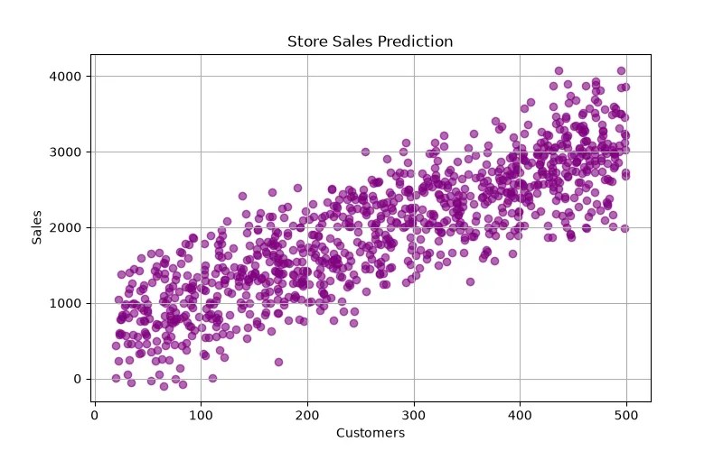

<h1 align="center">🛒 Store Sales Prediction</h1>

<h3 align="center">
Machine Learning Regression Project for Predicting Store Sales
</h3>

<h2>📖 Project Overview</h2>

Store Sales Prediction is a Machine Learning regression project that predicts
future sales of a store based on historical sales data and different business
factors.

The main goal of this project is to analyze previous sales patterns and build
a model that can estimate future revenue.

This type of prediction helps businesses make better decisions about inventory,
marketing strategies, and resource management.

<h2>🎯 What We Are Going To Do</h2>

<ul>

<li>Analyze historical store sales data</li>

<li>Understand sales patterns and trends</li>

<li>Clean and preprocess the dataset</li>

<li>Select important business features</li>

<li>Train a Machine Learning regression model</li>

<li>Evaluate prediction accuracy</li>

<li>Predict future sales</li>

</ul>

<h2>📊 Dataset</h2>

The dataset contains historical information about store transactions and sales.
Each row represents a sales record.

<table border="1">

<tr>
<th>Feature</th>
<th>Description</th>
</tr>

<tr>
<td>Date</td>
<td>Sales transaction date</td>
</tr>

<tr>
<td>Store ID</td>
<td>Store identification number</td>
</tr>

<tr>
<td>Product Category</td>
<td>Type of product sold</td>
</tr>

<tr>
<td>Number of Customers</td>
<td>Daily customer count</td>
</tr>

<tr>
<td>Advertising</td>
<td>Marketing investment</td>
</tr>

<tr>
<td>Previous Sales</td>
<td>Historical sales amount</td>
</tr>

<tr>
<td>Total Sales</td>
<td>Target value to predict</td>
</tr>

</table>

<h3 align="left">
Dataset Preview
</h3>

<h2>🧠 Machine Learning Model</h2>

<h3>Random Forest Regression</h3>

Random Forest Regression is used for this project because store sales depend
on many different factors and the relationship between features and sales is
usually not completely linear.

Random Forest combines multiple decision trees and creates a stronger model
with better prediction ability.

<pre>

Input:

Previous Sales = 5000
Customers = 300
Advertising = High

Output:

Predicted Sales = 6500

</pre>

<h2>❓ Why This Model?</h2>

<ul>

<li>Sales patterns are complex and nonlinear.</li>

<li>Multiple factors affect business revenue.</li>

<li>Random Forest handles many features effectively.</li>

<li>It reduces overfitting compared to a single decision tree.</li>

<li>It can measure feature importance.</li>

</ul>

<h2>🧮 Mathematical Explanation</h2>

Random Forest is based on Decision Trees.
Each tree makes a prediction and the final output is the average of all trees.

<b>
Prediction = (Tree₁ + Tree₂ + Tree₃ + ... + Treeₙ) / n
</b>

<h3>Decision Tree Splitting</h3>

The tree chooses the best feature split using variance reduction.

<b>
Variance = (1/n) Σ(x - x̄)²
</b>

The algorithm selects splits that reduce prediction error.

<h3>Mean Squared Error</h3>

<b>
MSE = (1/n) Σ(y - ŷ)²
</b>

Each tree tries to minimize this error during training.

<h2>⚙ Model Learning Process</h2>

<ul>

<li>Create multiple decision trees from random samples of data</li>

<li>Train each tree independently</li>

<li>Each tree learns different patterns</li>

<li>Combine all predictions</li>

<li>Generate final sales prediction</li>

</ul>

The randomness of trees helps the model become more accurate and prevents
overfitting.

<h2>📈 Model Evaluation</h2>

<h3>MAE (Mean Absolute Error)</h3>

Measures average prediction difference.

<b>
MAE = (1/n) Σ|y - ŷ|
</b>

<h3>RMSE (Root Mean Squared Error)</h3>

Penalizes larger sales prediction errors.

<b>
RMSE = √((1/n)Σ(y - ŷ)²)
</b>

<h3>R² Score</h3>

Shows how well the model explains sales variations.

<h2>🛠 Technologies Used</h2>

<ul>

<li>Python</li>

<li>Pandas</li>

<li>NumPy</li>

<li>Scikit-Learn</li>

<li>Matplotlib</li>

</ul>

<h2>📂 Project Structure</h2>

<pre>

Store-Sales-Prediction
│
├── dataset_generator.py
│
├── img
│   └── dataset.webp
│
├── models.pkl
│
├── train.py
│
├── predict.py
│
└── README.md

</pre>

<h2>🚀 Future Improvements</h2>

<ul>

<li>Use XGBoost and Gradient Boosting</li>

<li>Add time-series forecasting models</li>

<li>Predict seasonal sales trends</li>

<li>Create business analytics dashboard</li>

<li>Deploy real-time sales prediction system</li>

</ul>

<h2>👨‍💻 Author</h2>

⭐ Learning Machine Learning by Building Real Projects 🚀

