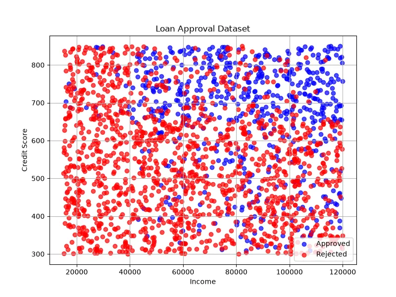

<h1 align="center">🏦 Loan Approval Prediction</h1>

<h3 align="center">
Machine Learning Classification Project for Predicting Loan Approval Decisions
</h3>

<h2>📖 Project Overview</h2>

Loan Approval Prediction is a Machine Learning classification project that
predicts whether a customer's loan application will be approved or rejected.

The model analyzes financial and personal information of applicants and learns
patterns from previous loan decisions.

This type of system can help banks and financial institutions make faster and
more accurate decisions while reducing human errors.

<h2>🎯 What We Are Going To Do</h2>

<ul>

<li>Analyze customer loan dataset</li>

<li>Understand important factors affecting loan approval</li>

<li>Clean and preprocess data</li>

<li>Convert categorical data into numerical values</li>

<li>Train a classification model</li>

<li>Evaluate model performance</li>

<li>Predict loan approval for new customers</li>

</ul>

<h2>📊 Dataset</h2>

The dataset contains information about customers and their loan applications.
Each row represents one applicant.

<table border="1">

<tr>
<th>Feature</th>
<th>Description</th>
</tr>

<tr>
<td>Gender</td>
<td>Applicant gender</td>
</tr>

<tr>
<td>Age</td>
<td>Customer age</td>
</tr>

<tr>
<td>Income</td>
<td>Monthly income</td>
</tr>

<tr>
<td>Loan Amount</td>
<td>Requested loan value</td>
</tr>

<tr>
<td>Credit Score</td>
<td>Customer credit history score</td>
</tr>

<tr>
<td>Employment Status</td>
<td>Job and employment information</td>
</tr>

<tr>
<td>Loan Status</td>
<td>Approved or Rejected</td>
</tr>

</table>

<h3 align="left">
Dataset Preview
</h3>

<h2>🧠 Machine Learning Model</h2>

<h3>Logistic Regression</h3>

Logistic Regression is used for this classification problem.
The model predicts the probability of loan approval based on applicant features.

Output:

<pre>

0 → Loan Rejected

1 → Loan Approved

</pre>

<h2>❓ Why This Model?</h2>

Loan approval prediction is a Binary Classification problem because the output
has only two possible classes.

<ul>

<li>The output is categorical.</li>

<li>The model provides probability estimation.</li>

<li>It is fast and efficient.</li>

<li>The mathematical decision boundary can be interpreted.</li>

<li>It works well for financial classification problems.</li>

</ul>

<h2>🧮 Mathematical Explanation</h2>

Logistic Regression uses the Sigmoid Function to convert predictions into
probabilities.

<b>
σ(z) = 1 / (1 + e⁻ᶻ)
</b>

Where:

<table border="1">

<tr>
<th>Symbol</th>
<th>Meaning</th>
</tr>

<tr>
<td>z</td>
<td>Linear combination of features</td>
</tr>

<tr>
<td>e</td>
<td>Euler's number</td>
</tr>

<tr>
<td>σ(z)</td>
<td>Probability of approval</td>
</tr>

</table>

The linear equation:

<b>
z = w₁x₁ + w₂x₂ + ... + wₙxₙ + b
</b>

If the probability is higher than 0.5, the model predicts approval.

<h2>⚙ Model Learning Process</h2>

During training, the model adjusts weights to separate approved and rejected
applications.

The model uses Cross Entropy Loss:

<b>
Loss = -[y log(p) + (1-y) log(1-p)]
</b>

<table border="1">

<tr>
<th>Symbol</th>
<th>Meaning</th>
</tr>

<tr>
<td>y</td>
<td>Actual class</td>
</tr>

<tr>
<td>p</td>
<td>Predicted probability</td>
</tr>

</table>

The goal is minimizing classification error.

<h2>📈 Model Evaluation</h2>

<h3>Accuracy</h3>

Shows the percentage of correct predictions.

<b>
Accuracy = Correct Predictions / Total Predictions
</b>

<h3>Precision</h3>

Measures how many approved predictions were actually correct.

<h3>Recall</h3>

Measures how many real approved loans were detected.

<h3>F1 Score</h3>

Balances precision and recall.

<h2>🛠 Technologies Used</h2>

<ul>

<li>Python</li>

<li>Pandas</li>

<li>NumPy</li>

<li>Scikit-Learn</li>

<li>Matplotlib</li>

<li>Jupyter Notebook</li>

</ul>

<h2>📂 Project Structure</h2>

<pre>

Loan-Approval-Prediction
│
├── dataset_generator.py
│
├── img
│   └── dataset.webp
│
├── models.pkl
│
├── train.py
│
├── predict.py
│
└── README.md
</pre>

<h2>🚀 Future Improvements</h2>

<ul>

<li>Use Random Forest Classifier</li>

<li>Use XGBoost for better accuracy</li>

<li>Add explainable AI techniques</li>

<li>Create banking decision dashboard</li>

<li>Deploy as a loan evaluation API</li>

</ul>

<h2>👨‍💻 Author</h2>

⭐ Learning Machine Learning by Building Real Projects 🚀

