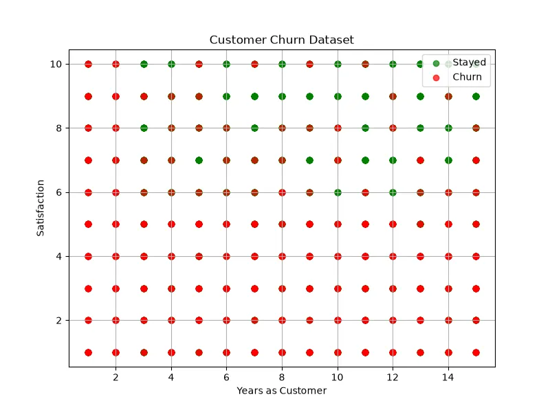

<h1 align="center">👥 Customer Churn Prediction</h1>

<h3 align="center">
Machine Learning Classification Project for Predicting Customer Retention
</h3>

<h2>📖 Project Overview</h2>

Customer Churn Prediction is a Machine Learning classification project that
predicts whether a customer will leave a service or continue using it.

Customer churn is an important problem for companies because losing customers
can reduce revenue and increase business costs.

The goal of this project is to analyze customer behavior and build a model
that identifies customers who have a high probability of leaving.

<h2>🎯 What We Are Going To Do</h2>

<ul>

<li>Analyze customer behavior dataset</li>

<li>Find important factors affecting customer churn</li>

<li>Clean and preprocess data</li>

<li>Convert categorical features into numerical values</li>

<li>Train a Machine Learning classification model</li>

<li>Evaluate model performance</li>

<li>Predict future customer churn</li>

</ul>

<h2>📊 Dataset</h2>

The dataset contains information about customers and their interaction with
a company service.

<table border="1">

<tr>
<th>Feature</th>
<th>Description</th>
</tr>

<tr>
<td>Age</td>
<td>Customer age</td>
</tr>

<tr>
<td>Gender</td>
<td>Customer gender</td>
</tr>

<tr>
<td>Monthly Charges</td>
<td>Amount paid monthly</td>
</tr>

<tr>
<td>Contract Type</td>
<td>Customer subscription type</td>
</tr>

<tr>
<td>Usage Time</td>
<td>Service usage duration</td>
</tr>

<tr>
<td>Support Calls</td>
<td>Number of customer support requests</td>
</tr>

<tr>
<td>Churn</td>
<td>Customer leaving status</td>
</tr>

</table>

<h3 align="left">
Dataset Preview
</h3>

<h2>🧠 Machine Learning Model</h2>

<h3>Random Forest Classifier</h3>

Random Forest Classifier is used to predict whether a customer will leave or
stay.

The algorithm creates multiple decision trees and combines their results to
produce a more accurate prediction.

<pre>

Input:

Contract = Monthly
Support Calls = High
Usage Time = Low

Output:

Churn = Yes

</pre>

<h2>❓ Why This Model?</h2>

<ul>

<li>Customer behavior is usually complex and nonlinear.</li>

<li>Random Forest can handle many different features.</li>

<li>It reduces overfitting compared to a single decision tree.</li>

<li>It provides feature importance information.</li>

<li>It works well with classification problems.</li>

</ul>

<h2>🧮 Mathematical Explanation</h2>

Random Forest is based on multiple Decision Trees.
Each tree gives a prediction and the final result is selected by voting.

<b>
Final Prediction = Majority Vote(Tree Predictions)
</b>

<h3>Gini Impurity</h3>

Decision trees select the best split using Gini impurity.

<b>
Gini = 1 - Σp²
</b>

<table border="1">

<tr>
<th>Symbol</th>
<th>Meaning</th>
</tr>

<tr>
<td>p</td>
<td>Probability of each class</td>
</tr>

</table>

The algorithm chooses splits that reduce impurity and create better separated
classes.

<h2>⚙ Model Learning Process</h2>

<ul>

<li>Create multiple decision trees</li>

<li>Use random samples from the dataset</li>

<li>Train each tree independently</li>

<li>Combine predictions from all trees</li>

<li>Generate final churn prediction</li>

</ul>

The combination of many models improves accuracy and stability.

<h2>📈 Model Evaluation</h2>

<h3>Accuracy</h3>

Measures the percentage of correct predictions.

<b>
Accuracy = Correct Predictions / Total Predictions
</b>

<h3>Precision</h3>

Measures how many predicted churn customers were actually churn customers.

<h3>Recall</h3>

Measures how many real churn customers were successfully detected.

<h3>F1 Score</h3>

Combines precision and recall into one metric.

<h2>🛠 Technologies Used</h2>

<ul>

<li>Python</li>

<li>Pandas</li>

<li>NumPy</li>

<li>Scikit-Learn</li>

<li>Matplotlib</li>

</ul>

<h2>📂 Project Structure</h2>

<pre>

Customer-Churn-Prediction
│
├── dataset_generator.py
│
├── img
│   └── dataset.webp
│
├── models.pkl
│
├── train.py
│
├── predict.py
│
└── README.md
</pre>

<h2>🚀 Future Improvements</h2>

<ul>

<li>Use XGBoost and Gradient Boosting</li>

<li>Add customer behavior analysis</li>

<li>Create customer retention recommendation system</li>

<li>Build real-time churn prediction dashboard</li>

<li>Deploy as a business AI solution</li>

</ul>

<h2>👨‍💻 Author</h2>

⭐ Learning Machine Learning by Building Real Projects 🚀

