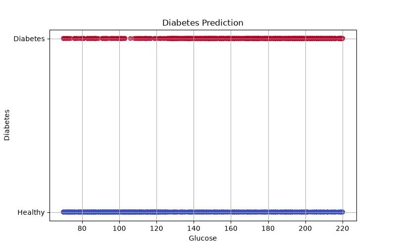

<h1 align="center">🩺 Diabetes Prediction</h1>

<h3 align="center">
Machine Learning Classification Project for Predicting Diabetes Risk
</h3>

<h2>📖 Project Overview</h2>

Diabetes Prediction is a Machine Learning classification project that predicts
whether a person has a risk of diabetes based on medical and health-related
features.

The purpose of this project is to analyze health data and build an AI model
that can assist in early diabetes risk detection.

Machine Learning can help healthcare systems identify high-risk patients and
provide earlier medical attention.

<h2>🎯 What We Are Going To Do</h2>

<ul>

<li>Analyze diabetes dataset</li>

<li>Understand relationships between health features</li>

<li>Clean and preprocess medical data</li>

<li>Select important features</li>

<li>Train a classification model</li>

<li>Evaluate prediction performance</li>

<li>Predict diabetes risk for new patients</li>

</ul>

<h2>📊 Dataset</h2>

The dataset contains medical information about individuals and their diabetes
status.

<table border="1">

<tr>
<th>Feature</th>
<th>Description</th>
</tr>

<tr>
<td>Pregnancies</td>
<td>Number of pregnancies</td>
</tr>

<tr>
<td>Glucose</td>
<td>Blood glucose level</td>
</tr>

<tr>
<td>Blood Pressure</td>
<td>Blood pressure measurement</td>
</tr>

<tr>
<td>BMI</td>
<td>Body Mass Index</td>
</tr>

<tr>
<td>Age</td>
<td>Person age</td>
</tr>

<tr>
<td>Insulin</td>
<td>Insulin level</td>
</tr>

<tr>
<td>Diabetes</td>
<td>Target class (Yes / No)</td>
</tr>

</table>

<h3 align="left">
Dataset Preview
</h3>

<h2>🧠 Machine Learning Model</h2>

<h3>Logistic Regression</h3>

Logistic Regression is used to classify patients into two groups:

<pre>

0 → No Diabetes

1 → Diabetes

</pre>

The model calculates the probability of diabetes based on medical features.

<h2>❓ Why This Model?</h2>

<ul>

<li>The problem is a binary classification problem.</li>

<li>The output has only two classes.</li>

<li>The model provides probability estimation.</li>

<li>The mathematical process is easy to interpret.</li>

<li>It is widely used for medical classification tasks.</li>

</ul>

<h2>🧮 Mathematical Explanation</h2>

Logistic Regression first calculates a linear combination of input features.

<b>
z = w₁x₁ + w₂x₂ + ... + wₙxₙ + b
</b>

Then it converts this value into probability using the Sigmoid Function.

<b>
σ(z) = 1 / (1 + e⁻ᶻ)
</b>

<table border="1">

<tr>
<th>Symbol</th>
<th>Meaning</th>
</tr>

<tr>
<td>x</td>
<td>Medical features</td>
</tr>

<tr>
<td>w</td>
<td>Feature weights</td>
</tr>

<tr>
<td>b</td>
<td>Bias</td>
</tr>

<tr>
<td>σ(z)</td>
<td>Diabetes probability</td>
</tr>

</table>

If the probability is higher than 0.5, the model predicts diabetes risk.

<h2>⚙ Model Learning Process</h2>

During training, the model adjusts weights to create the best separation between
diabetes and non-diabetes cases.

<h3>Binary Cross Entropy Loss</h3>

<b>
Loss = -[y log(p) + (1-y) log(1-p)]
</b>

<table border="1">

<tr>
<th>Symbol</th>
<th>Meaning</th>
</tr>

<tr>
<td>y</td>
<td>Actual class</td>
</tr>

<tr>
<td>p</td>
<td>Predicted probability</td>
</tr>

</table>

The training goal is minimizing classification error.

<h2>📈 Model Evaluation</h2>

<h3>Accuracy</h3>

Shows the percentage of correct predictions.

<b>
Accuracy = Correct Predictions / Total Predictions
</b>

<h3>Precision</h3>

Measures how many predicted diabetes cases were actually correct.

<h3>Recall</h3>

Measures how many real diabetes cases were detected.

<h3>F1 Score</h3>

Balances precision and recall.

<h3>Confusion Matrix</h3>

Shows the number of correct and incorrect classifications.

<h2>🛠 Technologies Used</h2>

<ul>

<li>Python</li>

<li>Pandas</li>

<li>NumPy</li>

<li>Scikit-Learn</li>

<li>Matplotlib</li>

</ul>

<h2>📂 Project Structure</h2>

<pre>

Diabetes-Prediction
│
├── dataset_generator.py
│
├── img
│   └── dataset.webp
│
├── models.pkl
│
├── train.py
│
├── predict.py
│
└── README.md

</pre>

<h2>🚀 Future Improvements</h2>

<ul>

<li>Use Random Forest and XGBoost models</li>

<li>Add medical feature analysis</li>

<li>Create health risk prediction dashboard</li>

<li>Use Deep Learning approaches</li>

<li>Deploy as a healthcare AI assistant</li>

</ul>

<h2>👨‍💻 Author</h2>

⭐ Learning Machine Learning by Building Real Projects 🚀

