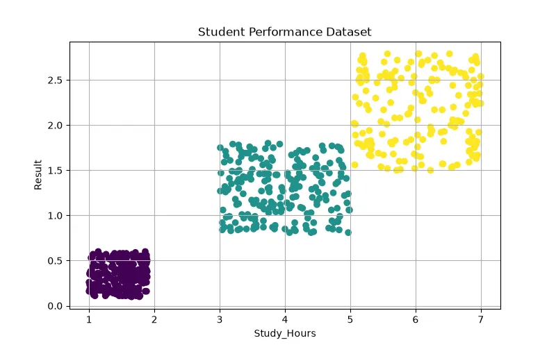

<h1 align="center">🌸 Iris Classification</h1>

<h3 align="center">
Machine Learning Classification Project for Flower Species Recognition
</h3>

<h2>📖 Project Overview</h2>

Iris Classification is a classic Machine Learning classification project that
predicts the species of an Iris flower based on its physical characteristics.

The goal of this project is to train a model that can identify different Iris
flower species by analyzing measurements such as petal length, petal width,
sepal length, and sepal width.

This project is one of the most famous examples in Machine Learning because it
demonstrates the complete workflow of a classification problem.

<h2>🎯 What We Are Going To Do</h2>

<ul>

<li>Load and analyze Iris dataset</li>

<li>Visualize relationships between features</li>

<li>Prepare training and testing data</li>

<li>Train a classification model</li>

<li>Evaluate model accuracy</li>

<li>Predict flower species for new samples</li>

</ul>

<h2>📊 Dataset</h2>

The Iris dataset contains information about three different flower species.
Each row represents one flower sample.

<table border="1">

<tr>
<th>Feature</th>
<th>Description</th>
</tr>

<tr>
<td>Sepal Length</td>
<td>Length of flower sepal</td>
</tr>

<tr>
<td>Sepal Width</td>
<td>Width of flower sepal</td>
</tr>

<tr>
<td>Petal Length</td>
<td>Length of flower petal</td>
</tr>

<tr>
<td>Petal Width</td>
<td>Width of flower petal</td>
</tr>

<tr>
<td>Species</td>
<td>Flower category</td>
</tr>

</table>

<h3 align="left">
Dataset Preview
</h3>

<h2>🌺 Classes</h2>

<table border="1">

<tr>
<th>Class</th>
<th>Description</th>
</tr>

<tr>
<td>Iris Setosa</td>
<td>First flower species</td>
</tr>

<tr>
<td>Iris Versicolor</td>
<td>Second flower species</td>
</tr>

<tr>
<td>Iris Virginica</td>
<td>Third flower species</td>
</tr>

</table>

<h2>🧠 Machine Learning Model</h2>

<h3>K-Nearest Neighbors (KNN)</h3>

K-Nearest Neighbors algorithm is used to classify Iris flowers based on their
similarity to previously known samples.

The algorithm finds the closest data points and predicts the class based on
their majority labels.

<pre>

Input:

Sepal Length = 5.1
Sepal Width = 3.5
Petal Length = 1.4
Petal Width = 0.2

Output:

Iris Setosa

</pre>

<h2>❓ Why This Model?</h2>

<ul>

<li>KNN works well for small datasets.</li>

<li>The Iris dataset contains clear class separation.</li>

<li>The algorithm is simple and easy to understand.</li>

<li>No complex training process is required.</li>

<li>It demonstrates distance-based classification.</li>

</ul>

<h2>🧮 Mathematical Explanation</h2>

KNN classifies samples by calculating the distance between data points.

<h3>Euclidean Distance</h3>

<b>
d = √((x₁-y₁)² + (x₂-y₂)² + ... + (xₙ-yₙ)²)
</b>

<table border="1">

<tr>
<th>Symbol</th>
<th>Meaning</th>
</tr>

<tr>
<td>d</td>
<td>Distance between two samples</td>
</tr>

<tr>
<td>x</td>
<td>New sample features</td>
</tr>

<tr>
<td>y</td>
<td>Existing dataset sample</td>
</tr>

</table>

The algorithm finds the nearest K samples and assigns the class with the most
votes.

<h2>⚙ Model Learning Process</h2>

<ul>

<li>Store training data</li>

<li>Receive a new flower sample</li>

<li>Calculate distance from all samples</li>

<li>Select nearest K neighbors</li>

<li>Count neighbor classes</li>

<li>Return the majority class</li>

</ul>

Example:

<pre>

K = 5

Neighbors:

Setosa
Setosa
Setosa
Versicolor
Setosa

Prediction:

Setosa

</pre>

<h2>📈 Model Evaluation</h2>

<h3>Accuracy</h3>

Shows the percentage of correctly classified flowers.

<b>
Accuracy = Correct Predictions / Total Predictions
</b>

<h3>Confusion Matrix</h3>

Shows classification results between different flower classes.

<h3>Classification Report</h3>

<ul>

<li>Precision</li>

<li>Recall</li>

<li>F1 Score</li>

</ul>

<h2>🛠 Technologies Used</h2>

<ul>

<li>Python</li>

<li>Pandas</li>

<li>NumPy</li>

<li>Scikit-Learn</li>

<li>Matplotlib</li>

</ul>

<h2>📂 Project Structure</h2>

<pre>

Iris-Classification
│
├── dataset_generator.py
│
├── img
│   └── dataset.webp
│
├── models.pkl
│
├── train.py
│
├── predict.py
│
└── README.md
</pre>

<h2>🚀 Future Improvements</h2>

<ul>

<li>Compare multiple classification algorithms</li>

<li>Use Support Vector Machine (SVM)</li>

<li>Apply Neural Networks</li>

<li>Create interactive flower prediction app</li>

<li>Deploy the model as an API</li>

</ul>

<h2>👨‍💻 Author</h2>

⭐ Learning Machine Learning by Building Real Projects 🚀

